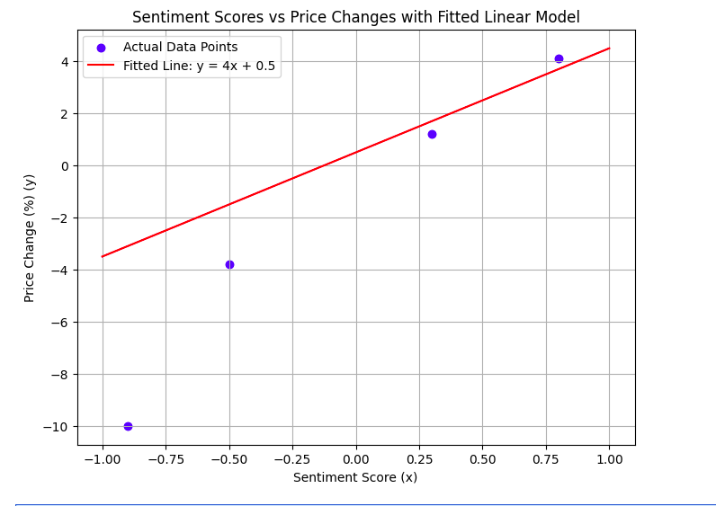

# Algebra and Linear Algebra in AI

Algebra and linear algebra might seem like complex math topics, but they are actually the foundation of many technologies that affect our lives, especially Artificial Intelligence (AI) in trading.

Imagine Alex, a data scientist at a hedge fund. His goal is to help predict Nvidia’s stock price by analyzing news articles about the company. Alex uses AI to assign a **sentiment score** to each news item, which shows whether the news is positive or negative.

But how does AI turn these sentiment scores into predictions of the stock price?
This is where **algebra** and **linear algebra** come into play.

---

### What is Algebra?

Algebra is a branch of mathematics that uses symbols and letters to represent numbers and quantities in formulas and equations.
It helps us describe how different things relate to each other.

For example, in the equation:

$$
y = m x + b
$$

algebra helps express the relationship between $x$ (input) and $y$ (output) using constants $m$ and $b$.

---

### What is Linear Algebra?

Linear algebra extends these ideas to work with **vectors** and **matrices**, which are like lists and tables of numbers.
It helps us analyze **many data points at once** and is essential for AI models working with large datasets.

---

### Linear Models in AI

Algebra lets us describe relationships between numbers using equations.
A simple and common algebraic equation AI uses is:

$$
y = m x + b
$$

Where:

* $y$ is the predicted change in Nvidia’s stock price (in percent),
* $x$ is the sentiment score from news,
* $m$ is the slope that AI learns (how strongly sentiment affects price),
* $b$ is the intercept AI adjusts (baseline change).

This is called a **linear model**, which you can think of as a straight line drawn through a set of data points.

---

### Sentiment Scores and Price Changes

| Sentiment Score ($x$) | Actual Price Change ($y$ percent) |
| --------------------- | --------------------------------- |
| 0.3                   | 1.2                               |
| -0.5                  | -3.8                              |
| 0.8                   | 4.1                               |
| -0.9                  | -10.0                             |

---

### Predict the Price Change

If AI finds:

* $m = 4$
* $b = 0.5$

What is the predicted price change when $x = 1.0$?

**Solution**:

$$
y = 4 \times 1.0 + 0.5 = 4 + 0.5 = 4.5 \text{ percent}
$$

### Understanding Slope and Intercept

* **What does the slope $m$ represent in this context?**
  It shows how much the price is expected to change for each unit change in sentiment.

* **What would it mean if $m$ were zero?**
  It would mean sentiment has no effect on price.

* **What role does the intercept $b$ play if $x = 0$?**
  It represents the baseline change when sentiment is neutral.

### When Linear Models Are Not Enough

Stock prices do not always move in a straight-line pattern. Markets can be **unpredictable and volatile**. That is why AI sometimes uses more complex models like quadratic equations:

$$
y = a x^2 + b x + c
$$

This equation adds an $x^2$ term, which allows the prediction curve to bend and better capture real-world ups and downs.

---

### Explore Non-Linearity

If:

* $a = -1$,
* $b = 3$,
* $c = 1$,

Calculate the predicted price change for $x = 1$.

**Solution**:

$$
y = -1 \times (1)^2 + 3 \times 1 + 1 = -1 + 3 + 1 = 3
$$

---

### Visualizing Curves

**How does adding the $x^2$ term change the shape of the prediction compared to the straight line?**
Try sketching a simple curve for both linear and quadratic equations to see the difference.

* Linear: straight line.
* Quadratic: curve that bends up or down depending on $a$.

---

### How Does AI Learn These Numbers?

AI does not guess these coefficients ($m, b, a, c$) randomly.
It **learns** them from data using **linear algebra**.

Linear algebra is the branch of math that helps AI handle **many numbers at once**, often arranged in tables called **matrices**.
Using these tools, AI can find the best-fitting equations for the data.

---

### How AI Learns

In Alex’s case, AI:

1. Looks at many past pairs of sentiment scores and actual price changes.
2. Organizes this data in matrices.
3. Uses linear algebra techniques to calculate the coefficients that minimize prediction errors.

---
Got it!
Here’s a slightly polished version, cutting down on the repetition of “sentiment,” removing emojis, no em dash, and adding an activity.

---

### **Functions — Mapping Inputs to Outputs**

A **function** is like a machine:

* You provide an input $x$,
* The machine applies a rule $f(x)$,
* You get an output $y$.

---

| **Example Function** |
| -------------------- |
| $f(x) = 2x + 3$      |

If input $x = 1$:

$$
f(1) = 2 \times 1 + 3 = 5
$$

This kind of rule can represent how one variable (like a numerical score) affects another (such as predicted price movement).

Why is this useful in AI?
AI models often use functions — sometimes very complex or nonlinear — to transform raw input data (like text scores, prices, volumes) into useful predictions or classifications.

Without functions, we cannot systematically map input patterns to meaningful outputs.

---

### Apply a Simple Function**

Given $f(x) = 3x - 2$:

* Calculate $f(2)$
* Calculate $f(-1)$

How does the function handle positive vs negative inputs?

---

### **Polynomials: Modeling Nonlinear Relationships**

Polynomials expand functions by adding powers:

| **General Polynomial**                        |
| --------------------------------------------- |
| $y = a_0 + a_1 x + a_2 x^2 + a_3 x^3 + \dots$ |

Example (quadratic):

$$
y = -x^2 + 4x + 1
$$

Why is this important in trading AI?
Markets rarely behave in simple, straight-line (linear) patterns.

* Small signals might barely affect price.
* Large, dramatic signals can cause outsized reactions.

Polynomials help AI capture these nonlinear relationships, making predictions that better match real-world market behavior.

---

### Explore Polynomial Shape**

Sketch or plot:

* $y = 2x + 1$ (linear)
* $y = -x^2 + 4x + 1$ (quadratic)

Where do they rise? Where do they bend?
How does adding the $x^2$ term change the behavior?

#### Compare Linear vs Polynomial**

Sketch or plot:

* $y = 2x + 1$ (straight line)
* $y = -x^2 + 4x + 1$ (parabola)

Observe: Where does each rise or bend? How does adding the $x^2$ term change the shape?

---

### **Solving Linear Systems: Balancing Multiple Conditions**

AI often needs to satisfy several equations at once.

Example system:

$$
2x + 3y = 5 \\
x - y = 2
$$

This can represent balancing multiple conditions, like maximizing returns while keeping risk in check.

---

#### **Solve the System**

Step 1: Solve second equation for $x$:

$$
x = y + 2
$$

Step 2: Plug into the first equation:

$$
2(y + 2) + 3y = 5 \rightarrow 2y + 4 + 3y = 5 \rightarrow 5y = 1 \rightarrow y = 0.2
$$

Step 3: Find $x$:

$$
x = 0.2 + 2 = 2.2
$$

Result:

$$
x = 2.2, \quad y = 0.2
$$

Why does this matter?
AI optimization (like adjusting portfolio weights or risk factors) often comes down to solving large systems like this, sometimes with hundreds of variables.

---

### **Vectors: Representing Data Points**

A **vector** is just an ordered list of numbers, like:

$$
[0.3, -0.5, 0.8]
$$

It can represent any series of features — for example, a snapshot of market indicators.

Why use vectors?
They allow AI to apply consistent operations across multiple inputs:

* Scaling (multiplying all elements),
* Weighting (applying learned coefficients),
* Transformations (changing coordinate systems or representations).

---

#### **Activity: Scale a Vector**

Given:

$$
v = [0.3, -0.5, 0.8], \quad m = 4
$$

Multiply each element:

$$
[0.3 \times 4, -0.5 \times 4, 0.8 \times 4] = [1.2, -2.0, 3.2]
$$

This effectively scales each input feature by its weight.

---

### **Matrices: Organizing Multi-Dimensional Data**

A **matrix** is like a table of vectors — rows and columns.

Example dataset:

| Day | Score 1 | Score 2 |
| --- | ------- | ------- |
| 1   | 0.3     | 1.2     |
| 2   | -0.5    | -3.8    |

Matrix form:

$$
\begin{bmatrix}
0.3 & 1.2 \\
-0.5 & -3.8
\end{bmatrix}
$$

Why use matrices?
AI can process **all rows at once** using matrix operations, which is much faster and more efficient than handling each individually.

---

#### **Matrix-Vector Multiplication**

Given:

* Data matrix:

$$
\begin{bmatrix}
0.3 & 1.2 \\
-0.5 & -3.8
\end{bmatrix}
$$

* Coefficient vector:

$$
\begin{bmatrix}
m \\
b
\end{bmatrix}
$$

Multiply:

$$
\begin{bmatrix}
0.3 \times m + 1.2 \times b \\
-0.5 \times m + (-3.8) \times b
\end{bmatrix}
$$

This gives predictions across multiple rows at once.

---

### **Determinants: Checking System Solvability**

The **determinant** is a single number calculated from a square matrix that tells you if a system has a unique solution.

Example:

$$
\begin{bmatrix}
2 & 3 \\
1 & -1
\end{bmatrix}
$$

Determinant:

$$
(2 \times -1) - (3 \times 1) = -2 - 3 = -5
$$

If determinant ≠ 0, the system has a unique solution.
If determinant = 0, the system has no or infinite solutions.

---

#### Calculate a Determinant**

Given:

$$
\begin{bmatrix}
4 & 2 \\
1 & 3
\end{bmatrix}
$$

Determinant:

$$
(4 \times 3) - (2 \times 1) = 12 - 2 = 10
$$

Result: System is solvable.

---

### **Summary Table**

| Concept        | Role in AI Trading                                     |
| -------------- | ------------------------------------------------------ |
| Functions      | Map input variables (scores, prices) to predictions.   |
| Polynomials    | Capture nonlinear effects in market reactions.         |
| Linear Systems | Solve for optimal combinations or satisfy constraints. |
| Vectors        | Represent feature sets compactly for mathematical use. |
| Matrices       | Organize and process large datasets efficiently.       |
| Determinants   | Check if a system has unique solutions (solvability).  |

---

### Think and Discuss

**Why do you think using matrices and linear algebra is helpful when working with large datasets?**

Possible answers:

* It allows efficient computation.
* It helps detect patterns across many variables.
* It scales well when data grows.

---

### **Which is the hardest point for the AI linear model?**

| **Sentiment Score (x)** | **Actual Price Change (y%)** |
| ----------------------- | ---------------------------- |
| 0.3                     | 1.2                          |
| -0.5                    | -3.8                         |
| 0.8                     | 4.1                          |
| -0.9                    | -10.0                        |
| 0.6                     | 3.5                          |
| 0.1                     | 0.7                          |
| -0.7                    | -2.5                         |
| 1.0                     | 6.0                          |

Look at:

* Most points follow a **roughly proportional** change (small sentiment → small price shift).
* But **(-0.9, –10.0)** stands out as a **sharp drop**, far steeper than other negative sentiment points.

This makes **(-0.9, –10.0)** the likely **outlier**:
-Much steeper negative price drop.
-Possibly influenced by non-linear effects or sudden market panic.
-Linear models (which fit lines) struggle with such **sharp bends**.

### Summary

In summary:

* **Algebra** gives AI the equations to describe relationships in data.
* **Linear algebra** provides the tools to learn these equations efficiently.

With these tools, AI can turn simple sentiment scores into powerful predictions that help traders like Alex make informed decisions.

